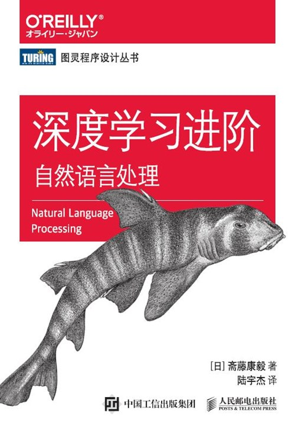

# 《深度学习进阶：自然语言处理》笔记

    理查德·费曼所说的“凡我不能创造的，我就不能理解。”

# 随书源码

<https://github.com/oreilly-japan/deep-learning-from-scratch-2>

# problems
第四章 训练有问题
第七章 train_seq2seq.py peeky_seq2seq有问题

## 目录
[第1章-神经网络的复习](ch01/第1章-神经网络的复习.ipynb)
[第2章-自然语言和单词的分布表示](ch02/第2章-自然语言和单词的分布式表示.ipynb)
[第3章-word2vec](ch03/第3章-wordvec.ipynb)
[第4章-word2vec的高速化](ch04/第4章-word2vec的高速化.ipynb)
[第5章-RNN](ch05/第5章-RNN.ipynb)
[第6章-Gated RNN](ch06/第6章-GatedRNN.ipynb)
[第7章-基于RNN生成文本](ch07/第7章-基于RNN生成文本.ipynb)
[第8章-Attention](ch08/第8章-Attention.ipynb)

## 资源

[CS224d: Deep Learning for Natural Language Processing](http://cs224d.stanford.edu/)

"""
The global statement
global_stmt ::=  "global" identifier ("," identifier)*
The global statement is a declaration which holds for the entire current code block. 
It means that the listed identifiers are to be interpreted as globals. It would be impossible to assign to a global
variable without global, although free variables may refer to globals without being declared global.
Names listed in a global statement must not be used in the same code block textually preceding that global statement.
Names listed in a global statement must not be defined as formal parameters or in a for loop control target, class definition,
function definition, or import statement.
CPython implementation detail: The current implementation does not enforce the two restrictions, but programs should not abuse
this freedom, as future implementations may enforce them or silently change the meaning of the program.
Programmer’s note: the global is a directive to the parser. It applies only to code parsed at the same time as the global 
statement. In particular, a global statement contained in a string or code object supplied to the built-in exec() function
does not affect the code block containing the function call, and code contained in such a string is unaffected by global 
statements in the code containing the function call. The same applies to the eval() and compile() functions.
"""
